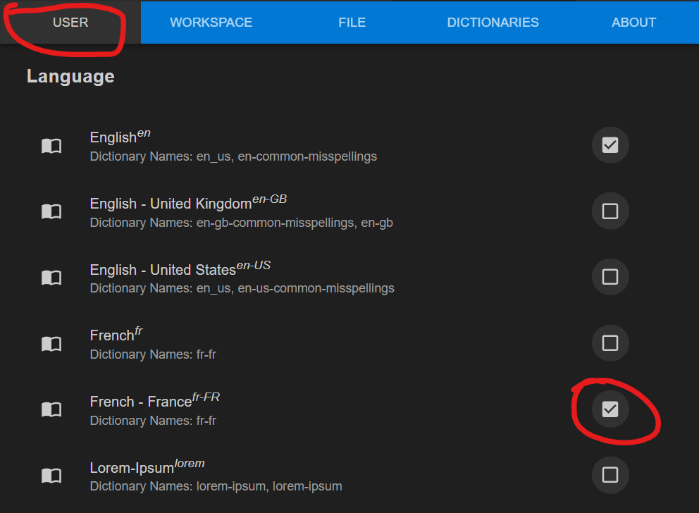

import Tabs from '@theme/Tabs';
import TabItem from '@theme/TabItem';

Markdown est un langage de *markup*, c'est-à-dire une syntaxe pour pimper votre texte : le mettre en **gras**, en *italique*, faire des titres, mettre des [liens](https://pointerpointer.com/), etc. Par exemple, [voici la documentation de la librairie *sil*, qui est écrite en Markdown](https://github.com/JulesFouchy/Simple-Image-Lib/blob/main/README.md?plain=1).

## Extensions

Vous aurez besoin de ces extensions pour facilement écrire du markdown dans VS Code :

- <VSCodeExtension id="shd101wyy.markdown-preview-enhanced"/> Pour voir le rendu final de votre texte.
- <VSCodeExtension id="yzhang.markdown-all-in-one"/> Pour que VSCode comprenne la syntaxe Markdown.
- <VSCodeExtension id="streetsidesoftware.code-spell-checker-french"/> Un correcteur d'orthographe. <b>ATTENTION</b> il est par défaut en anglais, et pour activer le français il faut faire ces manips :

  - Faites <kbd>F1</kbd> puis cherchez et cliquez sur `Show Spell Checker Configuration Info`
  - Sélectionnez l'onglet "User"
  - Activez le langage français en plus de l'anglais (quand il demande `Choose Destination`, sélectionnez `User` et pas `Workspace`).



## Syntaxe

Voici [une cheatsheet](https://github.com/adam-p/markdown-here/wiki/Markdown-Cheatsheet) où vous retrouvez tout la syntaxe.

En résumé :

<Tabs>
<TabItem value="syntaxe" label="Syntaxe" default>
<code>

\*Italique\*

\*\*Gras\*\*

\[lien](https://github.com/dsmtE/Learn--cpp_programming)

\!\[image](./output/pouet.png)

\#### Titre (plus ou moins gros en fonction du nombre de #)

```md
- Listes
- avec
- plusieurs items
```

```md
```cpp
// Bloc de code C++
int x{0};
std::cout << "x vaut " << x << '\n';
'``
```

Bout de code \`int x{0};\` au milieu d'une phrase.

Équations de math avec LaTeX :
```md
$$
\int_{-\infty{}}^{+\infty{}} x^2 dx
$$
```

Notes de bas de page \[^1]

\[^1]: Je suis une note de bas de page !

\> Citation

```txt
| Tableaux      | :grin:        | :sparkles:  |
| ------------- |:-------------:| -----:|
| col 3 is      | right-aligned | $1600 |
| col 2 is      | centered      |   $12 |
| zebra stripes | are neat      |    $1 |
```

Séparateur :

\---
</code>
</TabItem>

<TabItem value="résultat" label="Résultat" default>

*Italique*

**Gras**

[lien](https://github.com/dsmtE/Learn--cpp_programming)

Image :


#### Titre (plus ou moins gros en fonction du nombre de #)

- Listes
- avec
- plusieurs items

```cpp
// Bloc de code C++
int x{0};
std::cout << "x vaut " << x << '\n';
```

Bout de code `int x{0};` au milieu d'une phrase.

Équations de math avec LaTeX :
$$
\int_{-\infty{}}^{+\infty{}} x^2 dx
$$

Notes de bas de page [^1]

[^1]: Je suis une note de bas de page !

> Citation

| Tableaux      | 😁        | ✨  |
| ------------- |:-------------:| -----:|
| col 3 is      | right-aligned | $1600 |
| col 2 is      | centered      |   $12 |
| zebra stripes | are neat      |    $1 |

Séparateur :

---

</TabItem>
</Tabs>

Et vous également utiliser n'importe quelle balise html à tout moment, si la syntaxe Markdown ne fournit pas de quoi faire ce que vous voulez. Par exemple :
- `<kbd>F2</kbd>` pour faire des touches : <kbd>F2</kbd>
- `<summary></summary>` et `<details></details>` pour faire des sections collapsables :
```html
<details>
  <summary>Ouvre-moi !</summary>
Salut, ceci est un secret !
</details>
```
<details>
  <summary>Ouvre-moi !</summary>
Salut, ceci est un secret !
</details>

## Générer une table des matières

VS Code peut générer automatiquement une table des matières pour votre document, qui va lister toutes les différentes sections que vous aurez délimitées avec des titres (`#`, `##`, `###`, etc.).<br/>
Pour cela, mettez votre curseur là où vous voulez la générer (typiquement au début de votre document), puis faites <kbd>F1</kbd> et cherchez et sélectionnez `Markdown All In One: Create Table of Contents` (ou juste `toc` pour faire court).