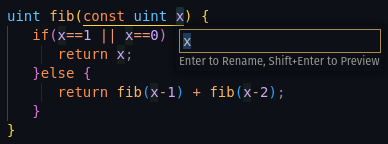
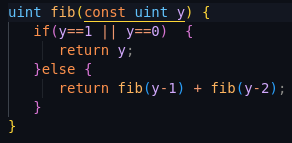

import { Chip } from "@mui/material";
import Tabs from '@theme/Tabs';
import TabItem from '@theme/TabItem';

VSCode est un **IDE** (Integrated Development Environment) développé par Microsoft. Il est gratuit et open-source. Il est très populaire et est utilisé par beaucoup de développeurs.

Il est versatile, compatible avec n'importe quel système d'exploitation et s'adapte, grâce à une gestion d'extensions très ingénieuse, à une multitude de langages et de cas d'utilisation.

Voilà une liste d'autres extensions que je recommande et que j'utilise quotidiennement:
- <VSCodeExtension id="ionutvmi.path-autocomplete"/> : Fournit la complétion des chemins dans l'IDE
- <VSCodeExtension id="vscode-icons-team.vscode-icons"/> : Permet d'avoir des icônes plus jolis par type de fichier
- <VSCodeExtension id="ms-vsliveshare.vsliveshare"/> : Cela permet de travailler à distance à plusieurs dans un seul et même éditeur. C'est génial pour travailler ensemble !
- <VSCodeExtension id="Gruntfuggly.todo-tree"/> : Permet de recenser et filtrer les <b>TODO</b> d'un projet de code.
- <VSCodeExtension id="teabyii.ayu"/> : Le thème de couleur que j'utilise 
- <VSCodeExtension id="yzhang.markdown-all-in-one"/>  et <VSCodeExtension id="goessner.mdmath"/> : Pour l'édition de markdown
- <VSCodeExtension id="formulahendry.auto-rename-tag"/> : Permet de refermer les balises web automatiquement

... et bien d'autres encore: <VSCodeExtension id="svelte.svelte-vscode"/>, <VSCodeExtension id="seatonjiang.gitmoji-vscode"/>, <VSCodeExtension id="ms-python.vscode-pylance"/>, <VSCodeExtension id="ms-python.python"/>, <VSCodeExtension id="rust-lang.rust-analyzer"/>, <VSCodeExtension id="tamasfe.even-better-toml"/>, <VSCodeExtension id="PolyMeilex.wgsl"/>

## Les raccourcis et actions rapides

Je vais présenter ci-dessous quelques unes des choses les plus importantes pour lesquelles un IDE peut vous aider.
Je vais les illustrer à l'aide de VSCode mais la majorité de ces fonctionnalités sont également présentes dans d'autres IDE.

### Recherche dans le fichier courant

Vous pouvez utiliser tout simplement la recherche dans le fichier courant en utilisant le raccourci : <kbd>CTRL</kbd>+<kbd>F</kbd>. Une popup va s'ouvrir et vous laisser naviguer avec les flèches entre les occurrences.
Vous pouvez également faire du remplacement via la popup.

### Recherche dans un projet

Avec le raccourci <kbd>CTRL</kbd>+<kbd>SHIFT</kbd>+<kbd>F</kbd> il est possible de rechercher dans un projet entier.
Cela peut être très utile si vous savez comment une variable s'appelle mais que vous ne retrouvez plus dans quel fichier elle se trouve par exemple.

La barre de recherche de VSCode est géniale, vous pouvez même renommer les choses (pour corriger une typo) par lot ou limiter la recherche à un dossier spécifique. Cette option est disponible en cliquant sur les trois points à droite.

### Renommer par symbole

Faites un clic droit et sélectionnez **"rename symbol"** ou même directement avec le raccourci <kbd>F2</kbd> sur ta sélection.

C'est mieux que de faire une simple recherche (avec <kbd>CTRL</kbd>+<kbd>F</kbd>) car ce renommage arrive à prendre en compte le contexte (les symboles) et permet de remplacer par exemple une variable nommée "Box" sans affecter une autre qui pourrait par exemple s'appeler "boundingBox".

<Tabs>

<TabItem value="1" label="Etape 1">

</TabItem>

<TabItem value="2" label="Etape 2">

Parfois une popup s'ouvre pour avoir une preview du renommage quand l'IDE n'est pas sûr à 100% de cibler les bons éléments.
Dans notre exemple, il ne s'est pas trompé mais il est possible d'adapter la sélection.

</TabItem>

<TabItem value="3" label="Etape 3">

</TabItem>

</Tabs>

### Aller à la définition

Cela vous mènera directement à la définition de la variable / fonction / classe. C'est une fonctionnalité super utile pour se déplacer dans un projet.

Et si vous voulez rester concentré sur la portion de code que vous êtes en train d'éditer, vous pouvez aussi regarder la définition et cela ouvrira une petite fenêtre dans votre fichier actuel.

### Aller à un symbole

Avec le raccourci <kbd>CTRL</kbd>+<kbd>SHIFT</kbd>+<kbd>O</kbd> vous pouvez accéder à la liste des symboles.
C'est en somme la liste des méthodes et fonctions du fichier courant.
Vous pouvez ensuite taper ce que vous recherchez pour affiner la liste.

### Aller à un fichier

De la même manière, il est possible d'aller à un fichier sans passer par l'explorateur en utilisant le raccourci : <kbd>CTRL</kbd>+<kbd>P</kbd>.
C'est beaucoup plus rapide si vous connaissez le nom du fichier que vous cherchez.

### Passer d'un fichier .hpp à un .cpp et inversement

Vous pouvez utiliser <kbd>ALT</kbd>+<kbd>O</kbd> pour passer rapidement du fichier d'en-tête au fichier d'implémentation.
Très utile lorsque vous écrivez du code pour une classe ou structure.

:::caution
Cette action ne fonctionne que dans le contexte d'un projet C++ et nécessite l'extension suivante <VSCodeExtension id="ms-vscode.cpptools-extension-pack"/> .
:::

---

### Aller plus loin

Si besoin, voici les liens vers les pdf de référence des raccourcis par plateforme de VSCode:

- [Windows](https://code.visualstudio.com/shortcuts/keyboard-shortcuts-windows.pdf)
- [macOS](https://code.visualstudio.com/shortcuts/keyboard-shortcuts-macos.pdf)
- [Linux](https://code.visualstudio.com/shortcuts/keyboard-shortcuts-linux.pdf)

