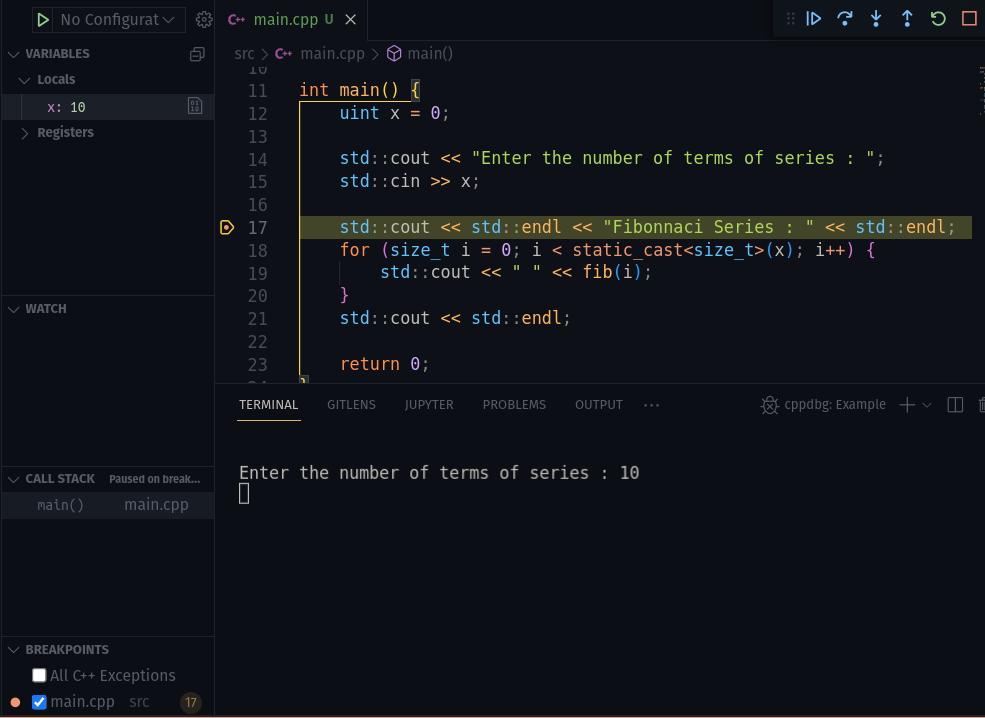
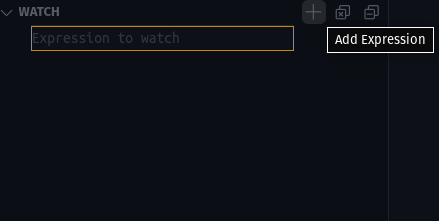
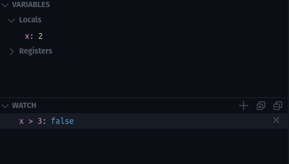

import { Button, Fab } from "@mui/material";

Vous avez déjà dû rencontrer des bugs dans vos programmes, et vous avez sûrement dû utiliser des `std::cout` pour essayer de comprendre ce qu'il se passait.

C'est une méthode qui peut être efficace, mais qui peut aussi être très longue et fastidieuse. Ajouter des `std::cout` partout dans le code, les enlever ensuite, etc.

Heureusement, il existe une solution bien plus efficace : le **débogueur**.

## Qu'est-ce qu'un débogueur ?

Un débogueur est un outil qui permet d'arrêter l'exécution d'un programme à un point précis, appelé **point d'arrêt** (ou **breakpoint** en anglais), ou juste avant qu'un crash se produise.

Une fois atteint, vous êtes en mesure d'inspecter la valeur de toutes les variables (et de toute la mémoire du programme).
Vous pouvez également voir quelles fonctions ont été appelées jusqu'à ce point grâce à la pile d'appel (**callstack**).

Enfin, vous serez en mesure d'avancer pas à pas dans l'exécution.

Nous allons voir comment cela se passe dans **VSCode** en **C++**.

## Configurer le débogueur

Pour commencer, il faut configurer le débogueur.

Si vous avez suivi le cours sur **CMake**, vous n'avez rien à faire, tout est déjà configuré.

<details>
<summary>Configuration manuelle </summary>

Sinon, sachez qu'il est possible de configurer le débogueur manuellement à l'aide d'un fichier **launch.json**.

Si vous voulez le configurer vous-même, vous pouvez vous rendre dans le panneau "**Run and Debug**" et cliquer sur le bouton "**Run and Debug**".

Vous devez ensuite sélectionner le débogueur que vous voulez utiliser (ici **C++ (GDB/LLDB)**) et cliquer sur **Add Configuration**.

Cela créera un fichier **launch.json** dans un dossier **/.vscode** à la racine du projet.

Si vous voulez plus de détails sur la configuration manuelle, vous pouvez vous rendre [ici](https://code.visualstudio.com/docs/cpp/launch-json-reference).

S'il y a une seule chose à vérifier, c'est que le champ "**program**" pointe bien vers votre exécutable.
En général, avec la configuration de **CMake**, il sera sous "$\{workspaceFolder\}/build/bin/Debug/YOURPROGRAM.exe"
</details>

## Utiliser le débogueur

Il suffit d'appuyer sur <kbd>CTRL</kbd> + <kbd>F5</kbd>, ou sur l'icône de **debug** :bug: dans la barre inférieure :


Ça y est ! VSCode a lancé le programme en mode débogage. On va pouvoir commencer à l'utiliser.

### Ajouter des points d'arrêt

Comme vous pouvez le voir sur la capture ci-dessous, le programme est arrêté avec une ligne surlignée.



C'est grâce à un point d'arrêt que j'ai ajouté à la ligne $17$.

Vous pouvez ajouter des points d'arrêt en cliquant à gauche de la ligne sur laquelle vous voulez vous arrêter, juste avant le numéro de ligne, ou en appuyant sur <kbd>F9</kbd> après avoir sélectionné une ligne.

Comme son nom l'indique, il permet d'**arrêter** le programme à un endroit précis pour inspecter celui-ci.

#### Points d'arrêt conditionnels

Il est possible de rendre un point d'arrêt conditionnel, c'est-à-dire qu'il ne sera déclenché que si une certaine condition est remplie.

Pour cela, il suffit de faire un clic droit sur le point d'arrêt et de sélectionner **Edit Breakpoint**.

Vous pouvez ensuite ajouter une expression qui sera évaluée à chaque fois que le programme passera par ce point d'arrêt pour déterminer s'il doit s'arrêter ou non.

Cela peut être très utile pour ne pas s'arrêter à chaque itération d'une boucle ou d'une fonction, mais seulement lorsqu'une certaine condition est remplie par exemple.

### Inspecter les variables

Dans la section **Variables**, vous pouvez voir toutes les variables du programme à l'instant où il est arrêté.


Par exemple, ici **x** vaut **10** !

Vous pouvez également laisser votre curseur sur une variable (hover) qui vous intéresse et un petit encadré va s'afficher pour vous montrer sa valeur.

C'est super utile et évite de devoir ajouter des `std::cout` (ou print/log en fonction des langages) pour afficher les valeurs actuelles de certaines variables.

Il est également possible de regarder spécifiquement certaines variables via la section **Watch**. (Cela peut être utile dans des cas plus complexes avec beaucoup de variables locales qui gênent la visibilité de la section **Variables** par exemple).



Vous pouvez aussi ajouter des expressions à évaluer dans cette section.

Par exemple, si on veut savoir si **x** est supérieur à **3**:



Cela peut être très utile pour vérifier des conditions ou des **valeurs intermédiaires** ou inspecter des variables qui ne sont pas directement accessibles (comme des **membres de structures** ou des **éléments de tableaux**).

### Pile d'appel

La pile d'appel liste les différents appels que le programme a parcouru (**fonctions**/**méthodes**) pour arriver au point où le programme est arrêté actuellement.


Vous pouvez voir que le programme est arrêté dans la fonction **fib** (qui est récursive).
Il est possible de naviguer dans la pile d'appel en cliquant sur les différentes lignes.

### Navigation en mode debug

Une fois que le programme est en mode **débogage**, un ensemble de boutons apparaît en haut de ton écran.


Ces boutons contrôlent l'exécution du programme :

- Le bouton **Continue** permet de lancer l'exécution du programme et de la poursuivre jusqu'à ce qu'un nouveau point d'arrêt soit atteint.

:::note
Celui-ci se transforme en un bouton pause lorsque le programme n'est pas actuellement arrêté.
Cela peut s'avérer utile quand vous avez l'impression que votre programme est bloqué (boucle infinie, appel asynchrone, etc).
:::

- **Step Over** et **Step Into** se déplacent d'une instruction à la fois et gèrent la façon dont les appels de fonctions sont traités.
**Step Over** sautera les appels de fonctions (ou de méthodes), tandis que **Step Into** suivra ces appels (pour rentrer dans la fonction qui va être appelée).

- La quatrième option est **Step Out**. Elle exécute toutes les commandes de la fonction en cours et s'interrompt lorsqu'elle revient à la fonction appelante.

- Les deux dernières options sont **Restart** et **Stop**, qui permettent de continuer l'exécution du programme ou de l'arrêter.

### Arrêt automatique sur les erreurs

Il est possible de configurer le débogueur pour qu'il s'arrête automatiquement lorsqu'une erreur se produit.

Une fois le programme lancé en mode débogage, vous pouvez allez dans la section **Breakpoints** et cocher la case **All C++ Exceptions**. Cela permettra de s'arrêter automatiquement lorsqu'une exception non gérée se produit.

Cela permet de voir où l'erreur se produit et de remonter la pile d'appel pour comprendre pourquoi et surtout où précisément l'erreur se produit.

:::info
généralement, le débogueur s'arrête à un point où l'exception est lancée mais au sein de la bibliothèque standard, donc il faut remonter un peu dans la pile d'appel pour trouver où l'erreur a été déclenchée depuis votre code.
:::

### Raccourcis clavier

Si vous utilisez le débogueur pour la première fois vous allez sûrement utiliser les boutons pour vous déplacer.

Mais il est possible d'utiliser des raccourcis clavier pour aller plus vite.
Une fois maîtrisés, ils vous permettront de gagner un temps considérable lors du débogage de vos programmes.

| Continue | Step Over  | Step Into | Step Out | Restart | Stop |
|:-:|:-:|:-:|:-:|:-:|:-:|
| <kbd>F5</kbd> | <kbd>F10</kbd> | <kbd>F11</kbd> | <kbd>SHIFT</kbd> + <kbd>F11</kbd> | <kbd>CTRL</kbd> + <kbd>SHIFT</kbd> + <kbd>F5</kbd> | <kbd>SHIFT</kbd> + <kbd>F5</kbd> |


## Erreurs courantes

Vous avez sûrement déjà rencontré des erreurs lors de la compilation ou de l'exécution de vos programmes.

C'est normal, tout le monde en fait, même les plus expérimentés.

Une erreur peut survenir à la **compilation** ou à **l'exécution** de votre programme, ll est important d'apprendre à les lire pour pouvoir les corriger et les comprendre.

Les erreurs de compilation sont les plus courantes. Elles se produisent lorsque le compilateur ne peut pas générer le fichier exécutable à partir de votre code.

Voici quelques exemples d'erreurs de compilation courantes.

### Erreur de segmentation

L'erreur de segmentation est une erreur très courante en C++. Elle se produit lorsque vous essayez d'accéder à une zone de mémoire à laquelle vous n'avez pas le droit d'accéder. Cela peut être dû à plusieurs raisons :

- Accès à un **tableau** en dehors de ses limites
- Accès à un **pointeur** non initialisé ou libéré (dangling pointer) (nous verrons cela plus tard)

Elle se manifeste par un message d'erreur du type :

```bash
Segmentation fault (core dumped)
```

### Erreur de syntaxe

Les erreurs de syntaxe sont les plus simples à trouver. Elles se produisent lorsque vous avez mal écrit quelque chose dans votre code.

Par exemple, si vous oubliez un point-virgule à la fin d'une ligne, ou si vous oubliez une accolade, le compilateur vous le signalera.

```cpp
int x {10}
```

```bash
error: expected ';' after expression
```

parfois le message d'erreur peut être un peu cryptique, mais en général, il vous indique la ligne et la colonne où il a trouvé l'erreur. Il suffit de regarder à cet endroit (et un peu avant) pour trouver l'erreur.


### Erreur de type

Les erreurs de type se produisent lorsque vous essayez d'assigner un type à un autre incompatible.

Par exemple, si vous essayez d'assigner un tableau (`std::vector`) à une variable de type `int` :

```cpp
int x { std::vector<int>{1, 2, 3} };
```

```bash
error: conversion from 'std::vector<int>' to non-scalar type 'int' requested
```

Les explications peuvent être un peu plus complexes, mais en général, le message d'erreur vous indique clairement ce qui ne va pas.

### Erreur de définition multiple

Les erreurs de définition se produisent lorsque vous déclarez une variable ou une fonction plusieurs fois.

Par exemple, si vous déclarez une variable dans un fichier d'en-tête et que vous l'incluez dans plusieurs fichiers source :

```cpp
// file1.hpp
#pragma once
int x;
```
    
```cpp
// file1.cpp
#include "file1.hpp"
int x {10};
```

```bash
error: redefinition of 'int x'
```

:::danger
C'est pour cela qu'il est très fortement déconseillé de déclarer des variables dans des fichiers d'en-tête ou des variables globales de manière générale.
:::

### Erreur de référence non définie

Les erreurs de référence non définie (Undefined reference) se produisent lorsque vous déclarez une fonction mais que vous ne l'implémentez pas.

Par exemple, si vous déclarez une fonction dans un fichier d'en-tête et que vous ne l'implémentez pas dans un fichier source :

```cpp
// file1.hpp
#pragma once
void foo();
```

```cpp
// file1.cpp
#include "file1.hpp"
int main() {
    foo();
    return 0;
}
```

```bash
error: undefined reference to `foo()'
```

Le compilateur ne peut pas trouver la définition de la fonction `foo` et vous signale une erreur.

### Erreur de lien

Les erreurs de lien (linker error) se produisent lorsque le compilateur ne peut pas trouver une bibliothèque ou un fichier objet nécessaire à la compilation.

Elles sont souvent plus difficiles à comprendre, mais en général, elles vous indiquent le nom du fichier ou de la bibliothèque manquante.


### Erreur de logique

Les erreurs de logique (ou d'implémentation) sont les plus difficiles à trouver. Elles se produisent lorsque votre programme ne fait pas ce que vous attendez de lui, mais qu'il compile et s'exécute sans erreur.

Pour les trouver, il faut souvent **déboguer** des points d'arrêt et inspecter les variables pour comprendre ce qui ne va pas.

Quelques exemples d'erreurs de logique typiques :

- Une **boucle infinie** :

```cpp
int i {0};
while (i < 10) {
    // Oubli d'incrémenter i
}
```

- Une **condition mal écrite** :

```cpp
int x {10};
if (x = 0) {
    // Ne sera jamais exécuté
}
```

- Un **tableau** ou un **pointeur** mal utilisé :

```cpp
int tab[10] {};
for (int i = 0; i <= 10; i++) {
    // Accès en dehors des limites du tableau
}
```

Cela peut parfois ne pas générer d'erreur de segmentation, mais le comportement du programme sera incorrect.

- Une utilisation de valeur non signée incorrecte :

```cpp
unsigned int x {0};
int y {-1};

if (x > y) {
    // Ne sera jamais exécuté
}
```

ou encore

```cpp
unsigned int x {10};
while (x >= 0) {
    // Boucle infinie
    x -= 1;
    // x est toujours positif et donc lorsqu'il est décrémenté mais qu'il est déjà à 0,
    //il repasse à la valeur maximale d'un unsigned int
}
```

- Une division par zéro :

```cpp
float division(float const x, float const y) {
    return x / y;
}

float x {10};
float y {0};

float z {division(x, y)};
```

```bash
Floating point exception (core dumped)
```

- Passage par copie au lieu de passage par référence :

```cpp
void increment(int x) {
    x++;
}

int x {10};
increment(x);
std::cout << x << std::endl; // Affiche 10
```

Ici la fonction `increment` prend `x` par copie et non par référence, donc la variable `x` n'est pas modifiée. C'est une copie locale à la fonction `increment` qui est modifiée.

### Exceptions

Dans le cas de la division par zéro par exemple on pourrait utiliser un `if` pour vérifier si `y` est différent de `0` avant de faire la division. Mais dans le cas où `y` est égal à `0` on aimerait pouvoir le signaler à l'utilisateur de la fonction pour afficher un message d'erreur ou alors effectuer une autre action spécifique (redemander une valeur à l'utilisateur par exemple).

C'est là qu'interviennent les **exceptions**. Les exceptions sont des objets qui permettent de signaler une erreur ou un comportement anormal dans un programme.

En C++ on utilise le mot clé `throw` pour lancer une exception.

```cpp
#include <stdexcept>

float division(float const x, float const y) {
    if (y == 0)
    {
        throw std::runtime_error("Division by zero");
    }
    return x / y;
}
```

De même par exemple lors de l'utilisation d'un `std::vector` si on essaye d'accéder au dernier élément grâce à la méthode `back()` alors que le vecteur est vide, une exception de type `std::out_of_range` sera lancée.

---

Ces exceptions peuvent être "attrapées" et traitées dans un bloc `try` `catch`:

```cpp
try
{
    float z {division(x, y)};
    std::cout << "Result: " << z << std::endl;
}
catch (std::exception& const e)
{
    std::cerr << e.what() << std::endl;
}
```

Il y aurait beaucoup à dire sur les exceptions (utilisation, avantage et inconvénient, etc) mais ce n'est pas le sujet de ce cours.
Je voulais juste vous montrer qu'elles existent et introduire le mot clé `throw` pour que vous puissiez l'identifier si vous le voyez dans du code.

## Résumé

- Le débogueur est un outil puissant pour comprendre le comportement de votre programme.
- Il permet d'arrêter l'exécution à un point précis appelé **point d'arrêt** (ou **breakpoint**).
- Vous pouvez **inspecter les variables**, la **pile d'appel** (**callstack**) et avancer pas à pas dans l'exécution.
- Il est possible de configurer le débogueur pour qu'il s'arrête automatiquement lorsqu'une erreur se produit.

- Les erreurs courantes sont :
    - Erreur de **segmentation** (segmentation fault) : accès à une zone de mémoire interdite
    - Erreur de **syntaxe** : oubli de point-virgule, d'accolade, etc
    - Erreur de **type** : assignation ou conversion de type incorrecte
    - Erreur de **logique** : boucle infinie, condition mal écrite, etc
    - Erreur de **compilation** : undefined reference, multiple definition, linker error, etc
- Il est possible de lancer des exceptions avec le mot clé `throw` et de les gérez avec un bloc `try` `catch`.


