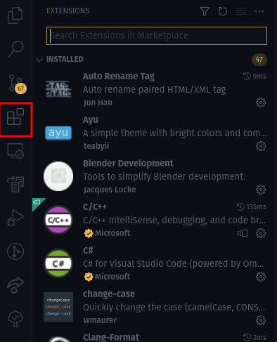

import { Chip } from "@mui/material";

# Visual Studio Code

Un **IDE** (Integrated Development Environment) est comme un éditeur de texte, mais beaucoup plus puissant !
Il possède de nombreuses fonctionnalités supplémentaires qui vous aideront à écrire, exécuter et déboguer votre code !

Ce cours va présenter principalement [Visual Studio Code](https://code.visualstudio.comp) (VSCode en abrégé) et je vous recommande fortement de l'utiliser pour débuter dans le monde de la programmation.

Il existe évidemment de nombreuses alternatives et si vous savez déjà vous servir d'un **IDE** alors vous pouvez très bien l'utiliser si vous savez bien vous en servir, mais j'aurais peut-être plus de difficultés pour vous aider.

## Installation

Tout d'abord il s'agit d'installer l'IDE.

Rendez-vous <Chip label="ici" component="a" href="https://code.visualstudio.com/"  size="small" variant="contained" color="primary" clickable/> et sélectionnez l'installeur adapté à votre système d'exploitation.

## Les extensions

Les extensions sont, comme le nom l'indique, des modules qui permettent d'étendre les fonctionnalités de l'IDE.

Elles sont listées [ici](https://marketplace.visualstudio.com/vscode) et vous pouvez également les parcourir pour les installer à l'intérieur de l'IDE via le raccourci <kbd>CTRL</kbd>+<kbd>SHIFT</kbd>+<kbd>X</kbd> ou en cliquant sur cet onglet:

N'hésitez pas à consulter les extensions recommandées par langage ou découvrir ce que d'autres personnes utilisent.

Concernant le C++, nous avons besoin au minimum d'installer ces extensions:
- <VSCodeExtension id="ms-vscode.cpptools-extension-pack"/>
- <VSCodeExtension id="twxs.cmake"/>
- <VSCodeExtension id="SteveBushResearch.BuildOutputColorizer"/>

Ces extensions vont nous permettre de lancer notre programme C++ sans difficulté.

Si vous voulez aller plus loin et connaître un peu mieux VSCode, je vous invite à aller regarder la page [suivante](/Annexes/VSCode).
