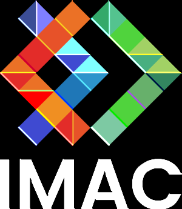
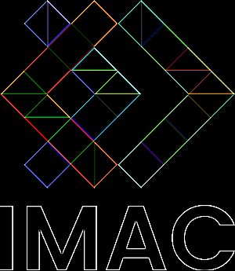
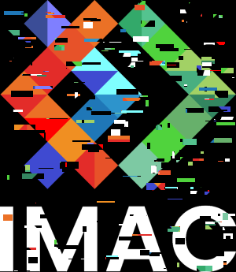
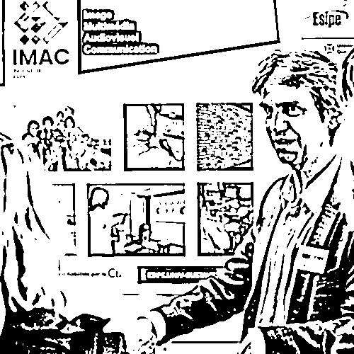

## Pitch

Durant ce workshop vous aller apprendre à coder des effets sur des images. (Comme on peut en trouver dans Photoshop, les filtres Instagram, etc.). Ce sera une première introduction à certains concepts de synthèse d'image, et une bonne occasion de vous entraîner en C++ !

|   |   |  |
|---|----|----|
|  |  |  |
|  |  |  |

## Attendus

Nous allons vous proposer [une liste d'exercices](./Exercices), plus ou moins difficiles (la difficulté est indiquée par le nombre d'étoiles ⭐). Nous ne nous attendons pas à ce que vous fassiez tous les exercices, mais faites en un maximum ! **Et il faudra au minimum faire un exercice de niveau 3 ou plus (⭐⭐⭐).** Vous êtes aussi les bienvenu.es pour inventer vos propres effets ou en faire que vous avez vu quelque part, même si ils ne sont pas dans la liste !

À la fin de la semaine il y aura [une mini-soutenance](#soutenance) (optionnelle, et qui est plus un exercice de vulgarisation qu'autre chose), et il faudra rendre [un mini-rapport](#rapport).

Le rendu se fera par groupes de 2 (et 1 groupe de 3 si vous êtes un nombre impair). Cependant, je m'attend à ce que vous fassiez un maximum de choses individuellement, surtout les exercices les plus faciles (niveau 1 et 2). Essayez de ne vous mettre à deux sur le même algo que quand ça commence à devenir compliqué et que réfléchir à deux dessus devient bénéfique.

## Pour bien démarrer

- Attention, il faut avoir [installé git](https://git-scm.com/book/en/v2/Getting-Started-Installing-Git) pour que ça marche ! <!-- - Le FetchContent en a besoin. -->
- La première fois le projet met du temps à se configurer, c'est normal (environ 1 ou 2 minutes).
- Il peut arriver, surtout que vous changez des choses dans le setup / CMake, que vous ayez des erreurs bizarres : supprimez le dossier *build* et recommencez.
- [Voici le template à utiliser](https://github.com/Cours-Prog-Imac/S1-Prog-Workshop). Vous pouvez télécharger ça et coder dedans, tout est déjà setup (CMake, librairies, images de test, etc.)
- Nous utiliserons la librairie *sil* pour lire, éditer et sauvegarder les images. Elle est très simple à utiliser et n'expose que le minimum nécessaire. Vous pouvez trouver sa documentation [sur GitHub](https://github.com/JulesFouchy/Simple-Image-Lib/tree/main#usage).
- Utilisez des images relativement petites (500x500 max), pour que le rendu soit quasi-instantané. Au moins pendant que vous faites vos tests. Vous avez déjà `"images/logo.png"` et `"images/photo.jpg"` dispos dans le template de projet. Certains effets marchent mieux sur une photo, et d'autres mieux sur une image flat, donc choisissez en fonction de l'effet sur quelle image l'appliquer. Vous pouvez aussi mettre vos propres images si vous voulez.
- Vous pouvez afficher l'image de sortie dans VSCode pour facilement voir le résultat en même temps que vous codez :

- Deux manières pour itérer sur l'image :
```cpp
// On passe sur tous les x et tous les y, et on accède au pixel correspondant :
for (int x{0}; x < image.width(); x++)
{
    for (int y{0}; y < image.height(); y++)
    {
        image.pixel(x, y).r = 0.f;
    }
}
// Ou alors, si on n'a pas besoin de connaître le x et le y, on a une syntaxe plus concise pour itérer sur tous les pixels :
for (glm::vec3& color : image.pixels())
{
    color.r = 0.f;
}
```
- Nos couleurs sont stockées dans des `glm::vec3 color`:
  - On peut accéder aux composantes rouge, verte et bleue avec `color.r`, `color.g` et `color.b`.
  - Les valeurs vont de 0 à 1. Par exemple un rouge pur sera `glm::vec3{1, 0, 0}`, du blanc sera `glm::vec3{1, 1, 1}` et du noir `glm::vec3{0, 0, 0}`.
  - Pour créer une couleur avec les trois composantes identiques (donc un niveau de gris), la syntaxe `glm::vec3{grey}` est équivalente à `glm::vec3{grey, grey, grey}`.
- Pour faire les différents exos, je vous conseille de faire une fonction par exo, et de tout mettre dans le même fichier `main.cpp`. C'est le plus simple, et tant que le fichier ne devient pas trop gros et bordélique je pense que c'est une bonne solution. Par exemple :
```cpp
void keep_green_only(sil::Image& image) // Prend l'image par référence pour pouvoir la modifier
{
    // ...
}

void channels_swap(sil::Image& image) // Prend l'image par référence pour pouvoir la modifier
{
    // ...
}

int main()
{
    {
        sil::Image image{"images/logo.png"}; // Lis l'image
        keep_green_only(image); // Utilise la fonction pour modifier l'image
        image.save("output/keep_green_only.png"); // Sauvegarde l'image
    }
    {
        sil::Image image{"images/logo.png"}; // Lis l'image
        channels_swap(image); // Utilise la fonction pour modifier l'image
        image.save("output/channels_swap.png"); // Sauvegarde l'image
    }
}
```

## HELP mon effet ne fait rien !

- Est-ce que vous n'avez pas oublié une référence quelque part ?
- Est-ce que vous sauvegardez bien la bonne image ?
- Est-ce qu'il n'y a pas un crash ? Lancez avec le debugger pour savoir !
- Est-ce que vous ne faites pas une division entre entiers, du genre `1 / image.width()` qui retourne toujours 0 parce que le résultat serait entre 0 et 1 et se retrouve arrondi ?

## Rapport

*À rendre avant lundi 27 à 9h*.<br/>
*Pour le rendu, il suffit de mettre votre lien git [ici](https://docs.google.com/spreadsheets/d/1x2uqvKdhndstidmW4xoWkNTlbwHFDWGlpohdb6TRORY/edit?usp=sharing)*.

Faites une section par exercice que vous avez fait. Montrez une image avant et après application de l'effet (comme c'est fait dans l'énoncé des exercices). Si vous jugez cela utile, vous pouvez mettre un petit texte expliquant des spécificités de l'algo que vous avez implémenté, et les pièges potentiels dans lesquels il ne faut pas tomber.

À faire en Markdown obligatoirement (si vous ne connaissez pas c'est l'occasion de découvrir, c'est super utile. Je vous montre tout ça vendredi).

À mettre directement en tant que ReadMe à la racine du repo.

## Soutenance

Présentez un des algos avancés que vous avez fait, en 5-10 minutes. C'est de la vulgarisation, il faut que tous vos camarades puissent comprendre. Expliquez l'algo dans les grandes lignes, et parlez des petits pièges de code auxquels il faut faire attention.

PS : la soutenance est optionnelle, on va essayer de ne pas présenter plusieurs fois le même algo, donc vous n'êtes pas obligé.es de passer. Et si plusieurs groupes souhaitent passer sur le même algo, on va essayer de vous regrouper pour que vous fassiez une seule présentation, ensemble.