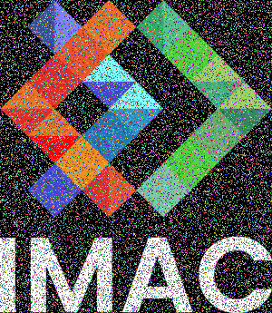
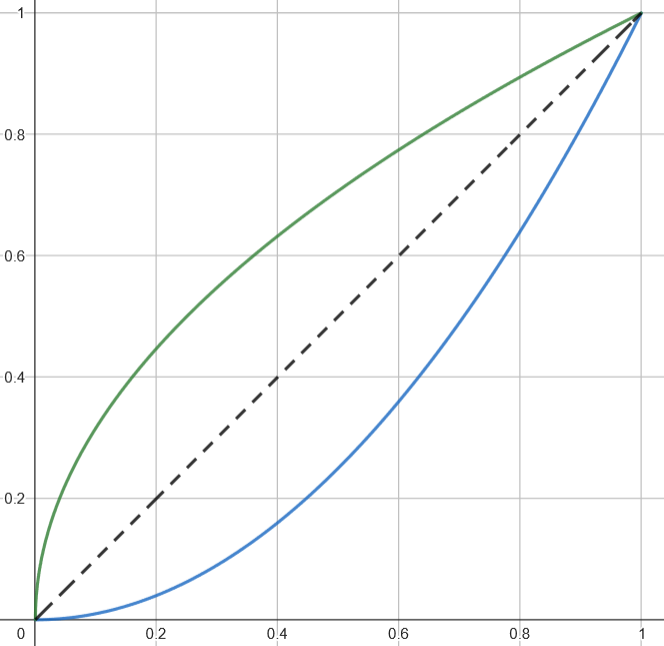
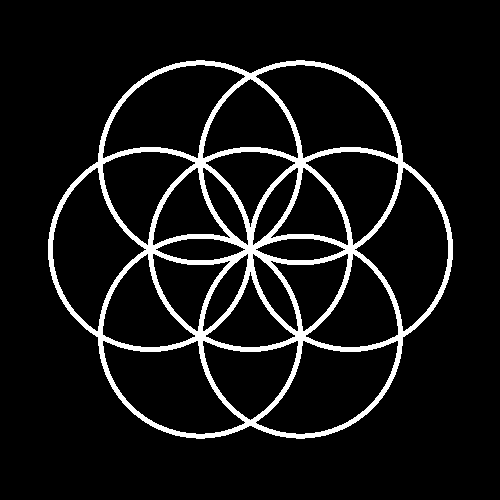
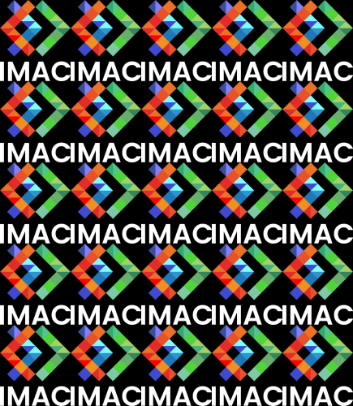
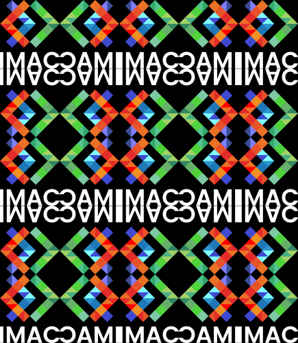
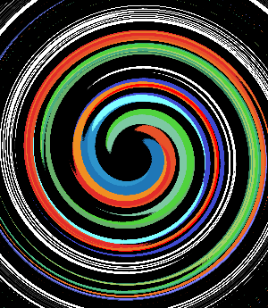
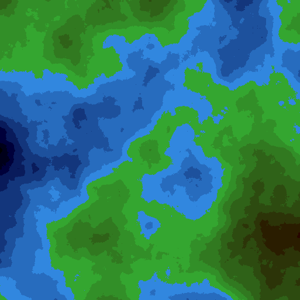

import YoutubeVideo from "@site/src/components/YoutubeVideo"
import ExplanationsAboutRandom from './_random.md';

## ⭐ Ne garder que le vert


<details><summary>Indice</summary>

Mettre le rouge et le bleu à 0.
</details>

## ⭐ Échanger les canaux


Par exemple, échangez le canal rouge et le canal bleu.

<details><summary>Indice</summary>

Il existe `std::swap(a, b)` pour échanger deux valeurs.
</details>

## ⭐ Noir & Blanc


<details><summary>Indice</summary>

N'hésitez pas à **aller chercher la formule sur internet** si besoin !
</details>

## ⭐ Négatif


<details><summary>Indice</summary>

Il faut trouver une formule simple, qui transforme le noir en blanc et le blanc en noir (i.e. qui transforme 0 en 1 et 1 en 0).
</details>

## ⭐ Dégradé


:::info
Vous pouvez créer une image noire avec
```cpp
sil::Image image{300/*width*/, 200/*height*/};
```
puis itérer sur les pixels pour les colorer.
:::

<details><summary>Indice</summary>

La couleur de chaque pixel doit dépendre de son x uniquement.
</details>

<details><summary>Indice 2</summary>

Quelle formule permettrait d'avoir 0 (noir) quand x vaut 0 (gauche), et 1 (blanc) quand x vaut `image.width() - 1` (droite) ?
</details>

## ⭐⭐ Miroir


<details><summary>Indice</summary>

On cherche une formule qui, quand x vaut 0, le transforme en `image.width() - 1`, quand x vaut 1, le transforme en `image.width() - 2`, etc.
</details>

## ⭐⭐ Image bruitée



<ExplanationsAboutRandom/>

<details><summary>Indice</summary>

Remplacez quelques pixels au hasard par une couleur aléatoire.
</details>

## ⭐⭐ Rotation de 90°


La formule générique pour un angle quelconque est un peu plus compliquée, mais pour 90° il y a une formule plus simple, essayez de la trouver !

<details><summary>Indice</summary>

Créez une nouvelle image avec `sil::Image new_image{new_width, new_height};` pour stocker le résultat de votre effet, car elle n'aura pas la même taille que l'image originale.
</details>

## ⭐⭐ RGB split


<details><summary>⚠️ Piège à éviter</summary>

Créez une nouvelle image et travaillez sur celle-ci. Il ne faut pas modifier l'image originale pendant que vous bouclez pour appliquer l'effet, sinon certains pixels n'utiliseront pas la bonne couleur de l'image originale, mais plutôt la couleur déjà modifiée par un pixel précédent, ce qui pourrait vous donner ce genre de rendu moins intéressant :


</details>

<details><summary>Indice</summary>

Chaque pixel va prendre comme couleur le rouge d'un pixel un peu à sa droite, son propre vert, et le bleu d'un pixel un peu à sa gauche.
</details>

## ⭐⭐ Luminosité

|   |   |  |
|---|----|----|
| Image originale | Après éclaircissement | Après assombrissement |

<details><summary>Indice</summary>

On voudrait des courbes comme celles-ci, qui diminuent tous les nombres entre 0 et 1 (courbe bleue) (c-à-d assombrisse), ou les augmentent (courbe verte) (c-à-d éclaircisse), tout en gardant 0 à 0 et 1 à 1 (afin de garder la plage dynamique de l'image, pour conserver des noirs purs et des blancs purs).

</details>
<details><summary>Indice 2</summary>

Les fonctions puissance font exactement ce qu'on veut !<br/>
La preuve : https://www.desmos.com/calculator/c3ztk51mng
</details>

## ⭐⭐ Disque


:::info
Vous pouvez créer une image noire avec
```cpp
sil::Image image{500/*width*/, 500/*height*/};
```
puis itérer sur les pixels pour les colorer.
:::

<details><summary>Indice</summary>

Quelle est l'équation d'un disque ? Comment peut on s'en servir pour savoir si un pixel est à l'intérieur ou à l'extérieur du disque ?
</details>

### ⭐ Cercle


En reprenant et modifiant légèrement votre code pour le disque, écrivez le code qui donne un cercle. (Son contour aura une épaisseur donnée `thickness`).

### ⭐⭐⭐ Rosace



Maintenant que vous savez dessiner un cercle, dessinez-en plusieurs sur la même image, à des positions bien choisies, de sorte à dessiner une rosace.
(PS : il va sûrement falloir faire de la trigo!)

<details><summary>Indice</summary>

Comment passer de coordonnées polaires (angle et rayon) à des coordonnées cartésiennes (x et y) ?
</details>

## ⭐⭐ Mosaïque



<details><summary>Indice</summary>

Une manière concise de faire ça est d'utiliser un modulo (`%`) quelque part.
</details>

### ⭐⭐⭐ Mosaïque miroir

Inversez une image sur deux :



## ⭐⭐⭐ Glitch


<ExplanationsAboutRandom/>

<details><summary>Indice</summary>

Prendre un rectangle de pixels et l'intervertir avec un autre rectangle de pixels, ailleurs dans l'image. Faire ça plusieurs fois.
</details>

## ⭐⭐⭐ Fractale de Mandelbrot


La fractale de Mandelbrot s'obtient ainsi : pour chaque nombre complexe `c` (correspondant à la position d'un pixel), on initialise un autre nombre complexe `z` à 0, puis on itère `z = z * z + c` un certain nombre de fois. Si le nombre `z` commence à devenir de plus en plus grand, alors `c` ne fait pas partie de la fractale et on colorie le pixel correspondant en noir. À l'inverse, si `z` reste de taille modérée peu importe le nombre d'itérations qu'on fait, alors le pixel fait partie de la fractale et on le colorie en blanc.

Plus précisément, on peut prouver que dès que `std::abs(z) > 2` alors le nombre `z` va forcément finir par grandir de plus en plus. On peut donc s'arrêter d'itérer dès que `std::abs(z) > 2`. Et pour obtenir une fractale plus jolie, plutôt que d'assigner du noir pur on peut assigner un gris plus ou moins sombre en fonction du nombre d'itérations qu'il a fallu faire avant que `std::abs(z) > 2`.

Conseil : si vous mappez directement le pixel (x, y) au nombre complexe x + i * y, vous allez visualiser les nombres complexes entre 0 et 500, et votre fractale va être beaucoup trop petite. Les nombres intéressants sont plutôt entre -2 et 2. Il va donc falloir appliquer une petite transformation à votre x et y pour les faire rentrer dans cet intervalle.

Conseil : vous pouvez inclure le header `<complex>` pour utiliser des nombres complexes. Un nombre complexe se définit comme ça :
```cpp
#include <complex>
int main()
{
    std::complex<float> z{3.f, 2.f}; // Définis le nombre z = 3 + 2*i
}
```
et s'utilise comme un nombre normal : vous pouvez faire des additions, multiplications etc.

:::info
Vous pouvez créer une image noire avec
```cpp
sil::Image image{500/*width*/, 500/*height*/};
```
puis itérer sur les pixels pour les colorer.
:::

## ⭐⭐⭐ Vortex



:::info
Pour appliquer une rotation à un point `point`, autour d'un autre point `center_of_rotation`, d'un angle `angle` (exprimé en radians) vous pouvez utiliser
```cpp
#include <glm/gtx/matrix_transform_2d.hpp>

glm::vec2 rotated(glm::vec2 point, glm::vec2 center_of_rotation, float angle)
{
    return glm::vec2{glm::rotate(glm::mat3{1.f}, angle) * glm::vec3{point - center_of_rotation, 0.f}} + center_of_rotation;
}
```
:::
:::info
Pour obtenir la distance entre deux points, vous pouvez utiliser `glm::distance(p1, p2)`;
:::

<details><summary>Indice</summary>
Chaque pixel subit une rotation, de plus en plus importante au fur et à mesure qu'on s'éloigne du centre.
</details>

## ⭐⭐⭐(⭐) Tramage


Vous pouvez lire [ce super article](https://surma.dev/things/ditherpunk/) sur le tramage (a.k.a. *dithering* en anglais).

Sur l'image ci-dessus j'ai utilisé de l'*ordered dithering* avec une matrice de Bayer 4x4 (a.k.a. de niveau 1). Tout est expliqué dans l'article ci-dessus ! (Plus précisément, j'ai repris la matrice et le code depuis [cet autre article](https://medium.com/the-bkpt/dithered-shading-tutorial-29f57d06ac39).)

## ⭐⭐⭐(⭐) Normalisation de l'histogramme

|   |   |
|---|----|
| Avant | Après |

L'algorithme consiste à trouver le pixel le moins lumineux et le pixel le plus lumineux de l'image, puis à appliquer une transformation à chaque pixel de sorte à ce que le pixel le plus sombre devienne un noir pur (`0`) et le plus lumineux devienne un blanc pur (`1`).<br/>
(PS : testez avec l'image `"images/photo_faible_contraste.jpg"`, vous verrez bien l'intérêt de l'effet.)

## ⭐⭐⭐⭐ Convolutions

<br/>*Box blur*

Les convolutions permettent d'implémenter plein d'effets (flou, détection de contour, augmentation de la netteté, etc.). L'effet va varier en fonction du *kernel* que vous utilisez lors de votre convolution. Tout est expliqué dans cette excellente vidéo, entre 1m10 et 4m18 :

<YoutubeVideo id="8rrHTtUzyZA"/>
<br/>

Conseil : une fois que vous savez que votre algo marche, si vous voulez tester avec des kernels plus gros, ça peut être lent, donc vous avez intérêt à build en release (demandez-moi si vous ne savez pas comment faire).

### ⭐ Netteté, Contours, etc.

|   |   |  |
|---|----|----|
| Emboss | Outline | Sharpen |

Une fois que vous avez implémenté l'algo générique de convolution qui prend n'importe quel kernel, vous pourrez trouver sur [ce site](https://setosa.io/ev/image-kernels/) une liste de kernels pour faire différents effets.

### ⭐⭐ Filtres séparables

| Box blur naïf, 100x100  | Box blur séparé, 100x100 |
|---|----|
|  |  |
| 7.44 secondes | 0.18 secondes |

Quand vous voulez faire un gros flou il faut augmenter la taille du kernel, ce qui peut considérablement ralentir l'algorithme. Heureusement, certains kernels ont une propriété qui nous permet de calculer leur convolution **BEAUCOUP** plus rapidement. Le *box blur* et le *gaussian blur* sont de tels kernels. Voici une vidéo expliquant tout ça :

<YoutubeVideo id="SiJpkucGa1o"/>

### ⭐⭐ Différence de gaussiennes


Voici une vidéo expliquant l'algorithme :

- **NB 1 :** Il parle de flou gaussien, mais vous pouvez tout aussi bien réutiliser votre box blur, pas la peine d'implémenter un flou gaussien.
- **NB 2 :** Ne faire que l'algo de base, présenté jusqu'à 4m09. Après ça ça devient très compliqué (mais très stylé néanmoins).

<YoutubeVideo id="5EuYKEvugLU"/>

## ⭐⭐⭐⭐ Tri de pixels


Voici une bonne vidéo expliquant l'algorithme (vous pouvez ignorer le début spécifique à Processing où on voit comment afficher l'image) :

<YoutubeVideo id="JUDYkxU6J0o"/><br/>

Utilisez `image.pixels()` pour récupérer le tableau contenant tous les pixels de l'image et le trier.

Ensuite, au lieu de trier tous les pixels de l'image, triez par colonne (ou par ligne) pour un effet plus joli. (Il faudra trier des sous-parties du tableau `image.pixels()`.) Ou encore, triez des sous-parties prises aléatoirement dans l'image.

:::info
Pour trier un tableau, vous pouvez utiliser `std::sort`. Vous verrez ça plus en détail au S2, mais voici une brève explication :
```cpp
std::vector<int> v{8, 5, 3, 1};
std::sort(v.begin(), v.end()); // Trie un tableau du début à la fin
// {1, 3, 5, 8}
```
```cpp
std::vector<int> v{8, 5, 3, 1};
std::sort(v.begin(), v.begin() + 2); // Trie les deux premiers éléments du tableau, c'est comme si on lui avait passé le tableau {8, 5}
// {5, 8, 3, 1}
```
```cpp
std::vector<int> v{8, 5, 3, 1};
std::sort(v.begin() + 1, v.begin() + 3); // Trie le sous-tableau {5, 3}
// {8, 3, 5, 1}
```
Et vous pouvez aussi choisir selon quel critère de comparaison les éléments seront triés :
```cpp
std::vector<glm::vec3> v{/*...*/};
std::sort(v.begin(), v.end(), [](glm::vec3 const& color1, glm::vec3 const& color2)
{
    return color1.r < color2.r; // Trie selon la composante rouge
});
```
```cpp
std::vector<glm::vec3> v{/*...*/};
std::sort(v.begin(), v.end(), [](glm::vec3 const& color1, glm::vec3 const& color2)
{
    return brightness(color1) < brightness(color2); // Trie selon la luminosité des couleurs (NB : c'est à vous de coder la fonction `brightness`)
});
```
On passe ce qu'on appelle une *lambda* en 3ème argument : c'est une fonction définie en plein milieu du code. Elle doit prendre en paramètre deux éléments du tableau (deux `vec3` en l'occurrence) et retourner un booléen indiquant qui est le plus petit des deux éléments.
:::

<ExplanationsAboutRandom/>

## ⭐⭐⭐⭐⭐ Filtre de Kuwahara (effet peinture à l'huile)


Voici une vidéo expliquant l'algorithme :<br/>
(La version simple de l'algo, qui est expliquée entre 3m11 et 3m30, suffit largement. (Mais si vous voulez aller plus loin, vous êtes les bienvenu.es bien sûr 😉))

<YoutubeVideo id="LDhN-JK3U9g"/>

## ⭐⭐⭐⭐⭐ K-means : trouver les couleurs les plus présentes dans une image

|   |  |   |   |
|---|----|----|----|
| Originale | 2 couleurs | 3 couleurs | 16 couleurs |

Trouvez les k couleurs les plus représentatives de l'image, puis assignez à chaque pixel la couleur dont il est le plus proche parmi les k.

Voici une bonne vidéo expliquant l'algorithme :

<YoutubeVideo id="yR7k19YBqiw"/>
<br/>

:::info
Vous pouvez utiliser `glm::distance(color1, color2)` pour obtenir la distance entre deux couleurs.
:::

<ExplanationsAboutRandom/>

## ⭐⭐⭐⭐⭐⭐ Diamond Square


Algorithme de génération de height map, qui peut ensuite être utilisée pour créer des terrains procéduraux dans des jeux vidéos par exemple.

Voici une bonne vidéo expliquant l'algorithme :

<YoutubeVideo id="4GuAV1PnurU"/>
<br/>

Conseil : commencez par travailler sur une image toute petite (e.g. 17x17), afin de bien voir les pixels et ce qu'il se passe.

:::info
Vous pouvez créer une image noire avec
```cpp
sil::Image image{17/*width*/, 17/*height*/};
```
puis itérer sur les pixels pour les colorer.
:::

### ⭐⭐ Colorer la height map



Appliquez un dégradé de couleur en fonction du niveau de gris de la height map.

:::info
Avec `glm::mix(color1, color2, pourcentage);` vous pouvez faire un mélange entre deux couleurs données.
:::

<details><summary>Indice</summary>

Essayez par exemple de faire un dégradé d'un bleu sombre à un bleu clair quand le niveau de gris est entre 0 et 0.5, et un autre dégradé entre du vert et du marron quand le niveau de gris est entre 0.5 et 1.
</details>

## Vous pouvez aussi implémenter vos propres effets !